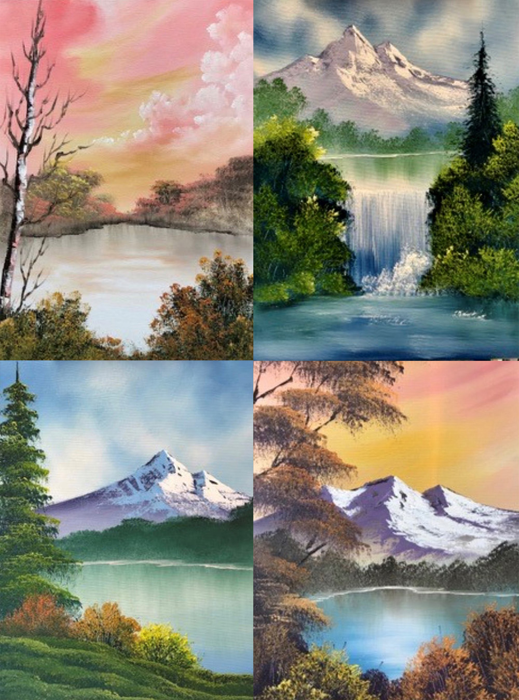

Starting next month, our Bob Ross workshops will also be held at our studio in Burleigh Heads on the Gold Coast. Continue reading for more details, or head over to arthoughts.com for bookings

<!-- end -->

These classes will be held on the 3rd Saturday of each month, and will be covering some of Bob's more simple designs on a smaller canvas, and will run for 3 hours. 

Like the workshops in Brisbane, they're suitable for any skill level, but are the perfect introduction for beginners to Bob's method. Check out [the website](https://arthoughts.com)