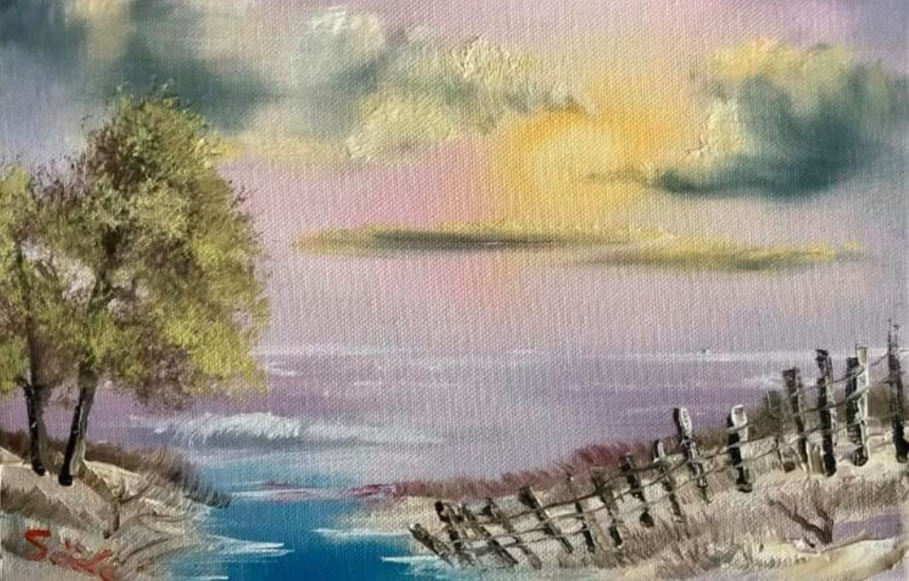
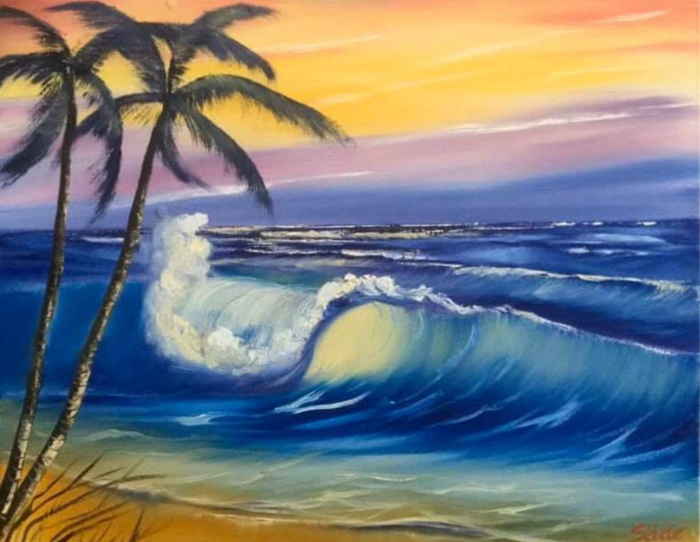
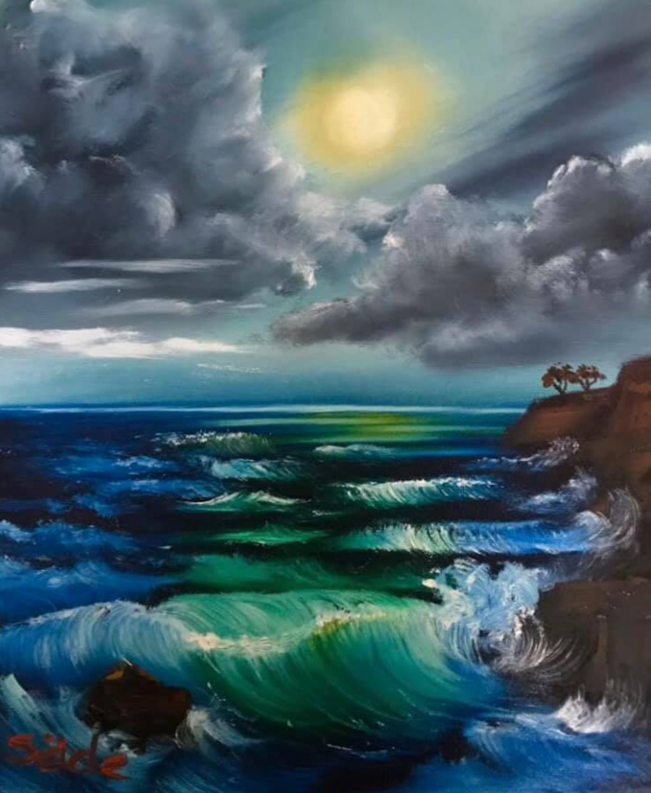
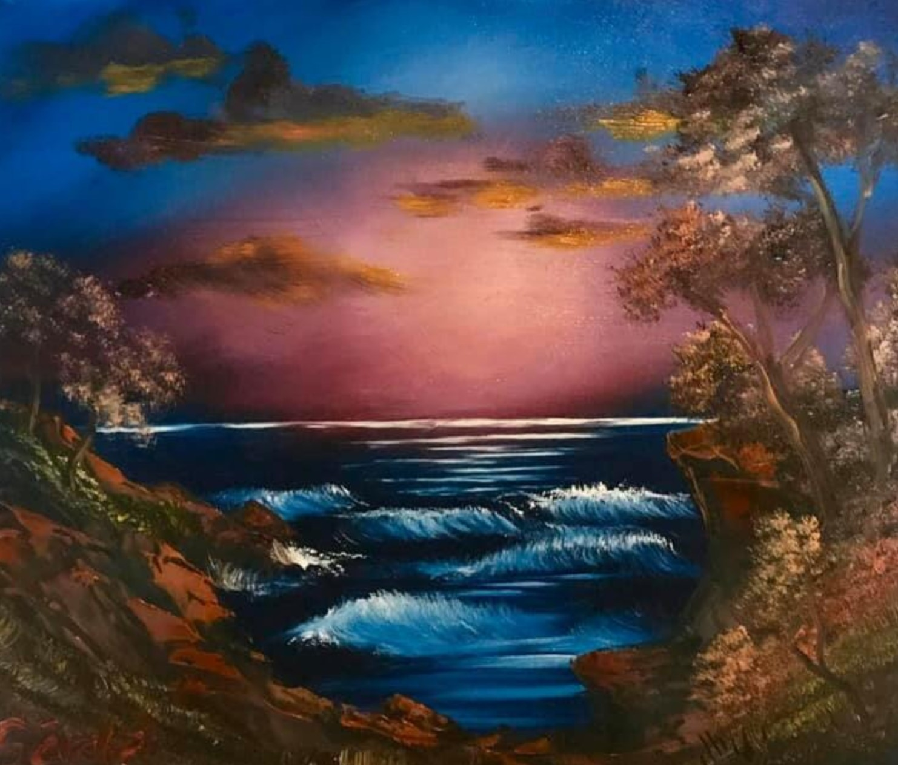

Working through season 9...used Bob’s newly arrived liquid clear today...very tricky, can’t picture students managing even the very thinnest coat. I’ve used a substitute medium when I ran out of Bob’s product and found that it works brilliantly, much better than Bob’s.
Still have plenty of time before I teach a seascape..thank goodness..I’ll be churning them out before then...picture a seascape factory! That’s me. 💜

<!-- end -->

Seascapes from series 1-9...going to focus on them for a while...feeling the need for it...to connect with their particular kind of mystery and beauty.

>The heart of man is very much like the sea.
>
>It has its storms,
>
>it has its tides
>
>and in its depths
>
>it has its pearls too.” 
> 
>*Vincent Van Gogh*

